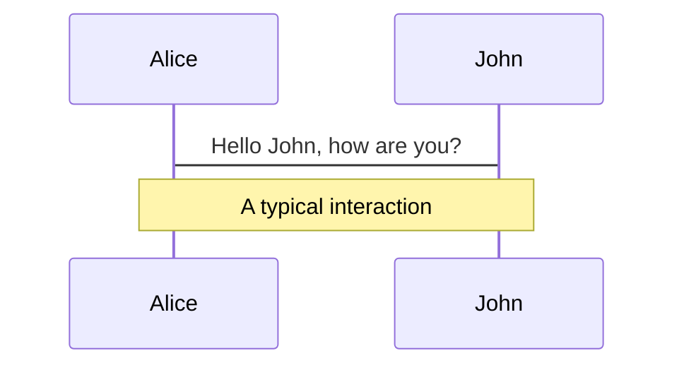
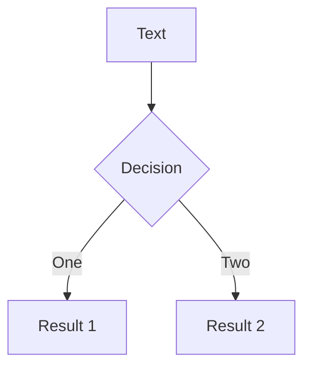
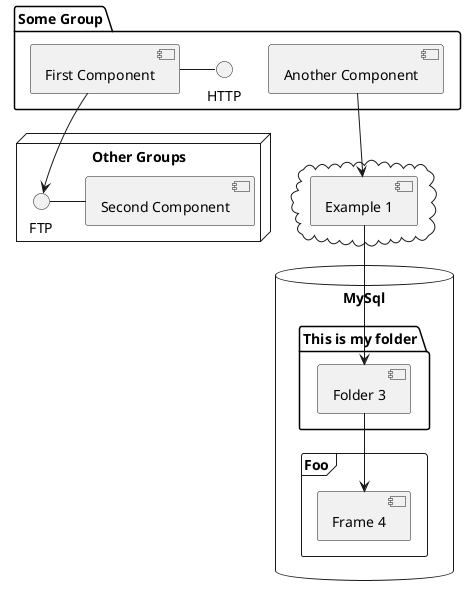

# Welcome to Slidev

Presentation slides for developers

<div class="pt-12">
  <span @click="$slidev.nav.next" class="px-2 py-1 rounded cursor-pointer" hover="bg-white bg-opacity-10">
    Press Space for next page <carbon:arrow-right class="inline"/>
  </span>
</div>

<div class="abs-br m-6 flex gap-2">
  <button @click="$slidev.nav.openInEditor()" title="Open in Editor" class="text-xl icon-btn opacity-50 !border-none !hover:text-white">
    <carbon:edit />
  </button>
  <a href="https://github.com/slidevjs/slidev" target="_blank" alt="GitHub"
    class="text-xl icon-btn opacity-50 !border-none !hover:text-white">
    <carbon-logo-github />
  </a>
</div>

---

# Slidevをインストール

slidevをインストールしよう<br>
Node.js >=14.0で動作します

```ts
npm init slidev@latest
```
もしくは
```ts
yarn create slidev
```

プロジェクトの名前や使用するパッケージマネージャーを聞かれるので好みで選択

```ts
✔ Project name: … slidev-test
  Scaffolding project in slidev-test ...
  Done.

✔ Install and start it now? … yes
✔ Choose the agent › npm
```
これでSlidevを利用可能です。ブラウザでhttp://localhost:3030/で確認できます。

---

# Slidevをインストール

二回目以降は生成されたディレクトリに移動して以下コマンドで起動
```ts
npm run dev -- ${Markdownファイルのパス}
```

実行例
```ts
npm run dev -- slides.md
```
---

# ナビゲーション

左下にカーソルを合わせると、ナビゲーションのコントロールパネルが表示されます。 [もっと詳しく](https://ja.sli.dev/guide/navigation.html)

### Keyboard Shortcuts

|     |     |
| --- | --- |
| <kbd>right</kbd> / <kbd>space</kbd>| 次のアニメーションまたはスライド |
| <kbd>left</kbd>  / <kbd>shift</kbd><kbd>space</kbd> | 前のアニメーションまたはスライド |
| <kbd>up</kbd> | 前のスライド |
| <kbd>down</kbd> | 次のスライド |

<!-- https://sli.dev/guide/animations.html#click-animations -->

<p v-after class="absolute bottom-23 left-45 opacity-30 transform -rotate-10">Here!</p>

---
layout: image-right
image: https://source.unsplash.com/collection/94734566/1920x1080
---

# Code

コードスニペットを使って、文字をハイライトさせることができます

```ts {all|2|1-6|9|all}
interface User {
  id: number
  firstName: string
  lastName: string
  role: string
}

function updateUser(id: number, update: User) {
  const user = getUser(id)
  const newUser = { ...user, ...update }
  saveUser(id, newUser)
}
```

<arrow v-click="3" x1="400" y1="420" x2="230" y2="330" color="#564" width="3" arrowSize="1" />

[^1]: [Learn More](https://ja.sli.dev/guide/syntax.html#%E3%82%B3%E3%83%BC%E3%83%89%E3%83%96%E3%83%AD%E3%83%83%E3%82%AF)

<style>
.footnotes-sep {
  @apply mt-20 opacity-10;
}
.footnotes {
  @apply text-sm opacity-75;
}
.footnote-backref {
  display: none;
}
</style>

---

# Components

<div grid="~ cols-2 gap-4">
<div>

スライド内で直接Vueコンポーネントを使用することができます。

私たちは `<Tweet/>` や `<Youtube/>` のようないくつかの組み込みコンポーネントを提供していますので、直接使用することができます。また、カスタムコンポーネントを追加することも非常に簡単です。

```html
<Counter :count="10" />
```

<!-- ./components/Counter.vue -->
<Counter :count="10" m="t-4" />

[詳しくはこちら](https://ja.sli.dev/builtin/components.html)

</div>
<div>

```html
<Tweet id="1390115482657726468" />
```

<Tweet id="1390115482657726468" scale="0.65" />

</div>
</div>


---
class: px-20
---

# アイコン

[Icons | Slidev](https://ja.sli.dev/guide/syntax.html#%E3%82%A2%E3%82%A4%E3%82%B3%E3%83%B3) に利用可能なアイコンの情報があります。<br>
[Tailwind CSS](https://tailwindcss.com/docs/animation) のクラスを設定するとアニメーションを付与できます


<div class="grid grid-cols-[50%,50%] gap-4"><div>

<center>

<logos-chrome class="text-5xl m-12 animate-bounce"/>
<logos-firefox class="text-5xl m-12 animate-bounce"/>
<logos-microsoft-edge class="text-5xl m-12 animate-bounce"/>

</center>

</div><div class="content-center">

<center>

<twemoji-grinning-face class="text-5xl m-12 animate-pulse"/>
<twemoji-party-popper class="text-5xl m-12 animate-ping"/>
<twemoji-cat-with-tears-of-joy class="text-5xl m-12 animate-spin"/>

</center>

</div></div>

---

# LaTeX

LaTeXは[KaTeX](https://katex.org/)によりアウトオブボックスでサポートされています。

<br>

Inline $\sqrt{3x-1}+(1+x)^2$

Block
$$
\begin{array}{c}

\nabla \times \vec{\mathbf{B}} -\, \frac1c\, \frac{\partial\vec{\mathbf{E}}}{\partial t} &
= \frac{4\pi}{c}\vec{\mathbf{j}}    \nabla \cdot \vec{\mathbf{E}} & = 4 \pi \rho \\

\nabla \times \vec{\mathbf{E}}\, +\, \frac1c\, \frac{\partial\vec{\mathbf{B}}}{\partial t} & = \vec{\mathbf{0}} \\

\nabla \cdot \vec{\mathbf{B}} & = 0

\end{array}
$$

<br>

[Learn more](https://sli.dev/guide/syntax#latex)

---

# Diagrams

Markdownで直接、テキスト記述から図/グラフを作成することができます。

<div class="grid grid-cols-3 gap-10 pt-4 -mb-6">







</div>

[Learn More](https://sli.dev/guide/syntax.html#diagrams)


---
layout: center
class: text-center
---

# Learn More

[Documentations](https://sli.dev) · [GitHub](https://github.com/slidevjs/slidev) · [Showcases](https://sli.dev/showcases.html)
