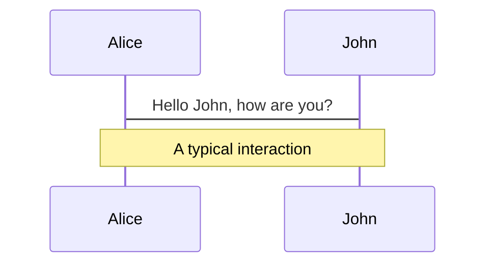
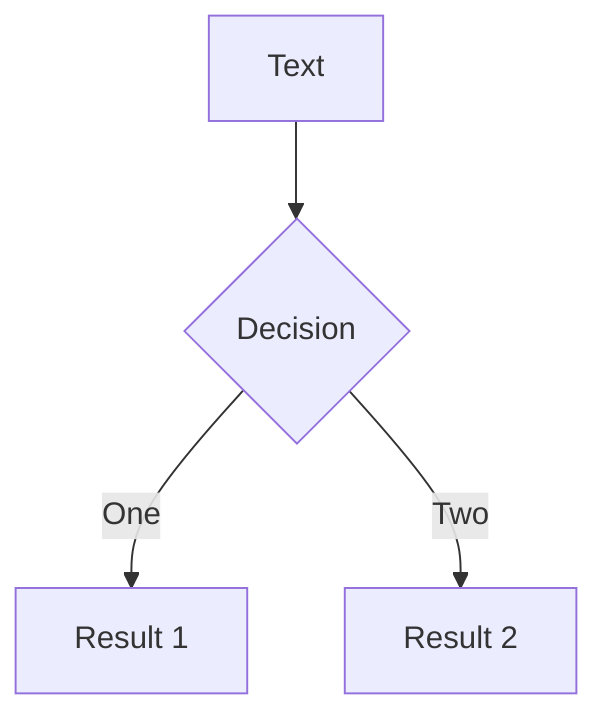
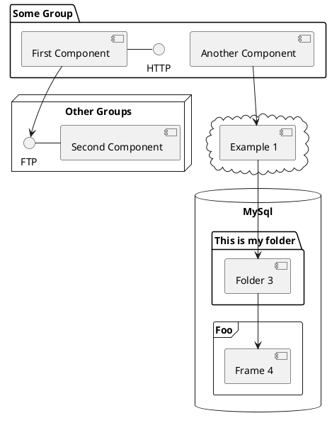

# IEがサポート外になったときに <br>使用できるCSS

<div class="pt-12">
  <span @click="$slidev.nav.next" class="px-2 py-1 rounded cursor-pointer" hover="bg-white bg-opacity-10">
    Press Space for next page <carbon:arrow-right class="inline"/>
  </span>
</div>

<div class="abs-br m-6 flex gap-2">
  <button @click="$slidev.nav.openInEditor()" title="Open in Editor" class="text-xl icon-btn opacity-50 !border-none !hover:text-white">
    <carbon:edit />
  </button>
  <a href="https://github.com/slidevjs/slidev" target="_blank" alt="GitHub"
    class="text-xl icon-btn opacity-50 !border-none !hover:text-white">
    <carbon-logo-github />
  </a>
</div>

---

# filter
CSSのみで被写体に影をつける [もっと詳しく](https://developer.mozilla.org/ja/docs/Web/CSS/filter)

<div class="grid grid-cols-2 gap-4">
<div>
  

  ```css
  img {
      filter: drop-shadow(10px 10px 0 #999999);
    }
  ```
</div>
<div>
  

  ```css
  img {
      filter: blur(3px);
  }
  ```
</div>

</div>

<style>
  img {
    width: 200px;
    height: auto;
    margin: 20px auto 0;
  }
  .img-1 {
    filter: drop-shadow(10px 10px 0 #999999);
  }
  .img-2 {
    filter: blur(3px);
  }
</style>
---

# object-fit: cover

左下にカーソルを合わせると、ナビゲーションのコントロールパネルが表示されます。 [もっと詳しく](https://coliss.com/articles/build-websites/operation/css/background-videos-used-object-fit.html)

<div class="grid grid-cols-2 gap-4">
<div>
  

  ```css
  img {
      filter: drop-shadow(10px 10px 0 #999999);
    }
  ```
</div>
<div>
  

  ```css
  img {
      filter: blur(3px);
  }
  ```
</div>

</div>

<style>
  img {
    width: 200px;
    height: auto;
    margin: 20px auto 0;
  }
  .img-1 {
    display: block;
    width: 100%;
    height: 300px;
    object-fit: cover;
  }
  .img-2 {
    filter: blur(3px);
  }
</style>
---

# grid

コードスニペットを使って、文字をハイライトさせることができます

<div class="grid-box">
  <div class="item item01">item01</div>
  <div class="item item02">item02</div>
  <div class="item item03">item03</div>
  <div class="item item04">item04</div>
  <div class="item item05">item05</div>
  <div class="item item06">item06</div>
</div>

<style>
.grid-box {
  display:grid;
  gap: 10px;
  margin-top: 10px;
}
.grid-box .item {
  padding: 15px;
  font-weight: bold;
}
.grid-box .item01 {
  grid-row: 1 / 2;
  grid-column: 1 / 2;
  background: #f6ffc5;
}
.grid-box .item02 {
  grid-row: 1 / 5;
  grid-column: 2 / 3;
  background: #bef5ff;
}
.grid-box .item03 {
  grid-row: 2 / 3;
  grid-column: 1 / 2;
  background: #c5ffc8;
}
.grid-box .item04 {
  grid-row: 3 / 4;
  grid-column: 1 / 2;
  background: #ffc5c5;
}
.grid-box .item05 {
  grid-row: 4 / 5;
  grid-column: 1 / 2;
  background: #f5c5ff;
}
.grid-box .item06 {
  grid-row: 5 / 6;
  grid-column: 1 / 3;
  background: #bcbbff;
}
</style>

---

# position: sticky
セクション毎に追従させることができる。<br>
position: fixed; と異なり、ウィンドウを基準に追従するのではなく、ブロックを基準にして追従します。


<div class="sticky-wrap">
  <div class="A-block sticky-block">
    <div class="sticky">A</div>
    <p class="ttl02">Aブロック</p>
    <p class="txt">ダミーテキストダミーテキストダミーテキスト<br> ダミーテキストダミーテキストダミーテキストダミーテキストダミーテキストダミーテキスト<br> ダミーテキストダミーテキストダミーテキストダミーテキストダミーテキストダミーテキストダミーテキストダミーテキスト</p>
    <p class="txt">ダミーテキストダミーテキストダミーテキスト<br> ダミーテキストダミーテキストダミーテキストダミーテキストダミーテキストダミーテキスト<br> ダミーテキストダミーテキストダミーテキストダミーテキストダミーテキストダミーテキストダミーテキストダミーテキスト</p>
    <p class="txt">ダミーテキストダミーテキストダミーテキスト<br> ダミーテキストダミーテキストダミーテキストダミーテキストダミーテキストダミーテキスト<br> ダミーテキストダミーテキストダミーテキストダミーテキストダミーテキストダミーテキストダミーテキストダミーテキスト</p>
  </div>
  <div class="B-block sticky-block">
    <div class="sticky">B</div>
    <p class="ttl02">Bブロック</p>
    <p class="txt">ダミーテキストダミーテキストダミーテキスト<br> ダミーテキストダミーテキストダミーテキストダミーテキストダミーテキストダミーテキスト<br> ダミーテキストダミーテキストダミーテキストダミーテキストダミーテキストダミーテキストダミーテキストダミーテキスト</p>
    <p class="txt">ダミーテキストダミーテキストダミーテキスト<br> ダミーテキストダミーテキストダミーテキストダミーテキストダミーテキストダミーテキスト<br> ダミーテキストダミーテキストダミーテキストダミーテキストダミーテキストダミーテキストダミーテキストダミーテキスト</p>
    <p class="txt">ダミーテキストダミーテキストダミーテキスト<br> ダミーテキストダミーテキストダミーテキストダミーテキストダミーテキストダミーテキスト<br> ダミーテキストダミーテキストダミーテキストダミーテキストダミーテキストダミーテキストダミーテキストダミーテキスト</p>
  </div>
  <div class="C-block sticky-block">
    <div class="sticky">C</div>
    <p class="ttl02">Cブロック</p>
    <p class="txt">ダミーテキストダミーテキストダミーテキスト<br> ダミーテキストダミーテキストダミーテキストダミーテキストダミーテキストダミーテキスト<br> ダミーテキストダミーテキストダミーテキストダミーテキストダミーテキストダミーテキストダミーテキストダミーテキスト</p>
    <p class="txt">ダミーテキストダミーテキストダミーテキスト<br> ダミーテキストダミーテキストダミーテキストダミーテキストダミーテキストダミーテキスト<br> ダミーテキストダミーテキストダミーテキストダミーテキストダミーテキストダミーテキストダミーテキストダミーテキスト</p>
    <p class="txt">ダミーテキストダミーテキストダミーテキスト<br> ダミーテキストダミーテキストダミーテキストダミーテキストダミーテキストダミーテキスト<br> ダミーテキストダミーテキストダミーテキストダミーテキストダミーテキストダミーテキストダミーテキストダミーテキスト</p>
  </div>
</div>

<style>
  .sticky-wrap {
    height: 350px;
    overflow: scroll;
  }
  .sticky-block .sticky {
    background: #dfdfdf;
    font-weight: 700;
    margin-bottom: 20px;
    padding: 10px 15px;
    position: -webkit-sticky;
    position: sticky;
    left: 0;
    top: -1px;
  }
</style>

---

# アイコン

[Icons | Slidev](https://ja.sli.dev/guide/syntax.html#%E3%82%A2%E3%82%A4%E3%82%B3%E3%83%B3) に利用可能なアイコンの情報があります。<br>
[Tailwind CSS](https://tailwindcss.com/docs/animation) のクラスを設定するとアニメーションを付与できます


<div class="grid grid-cols-[50%,50%] gap-4"><div>

<center>

<logos-chrome class="text-5xl m-12 animate-bounce"/>
<logos-firefox class="text-5xl m-12 animate-bounce"/>
<logos-microsoft-edge class="text-5xl m-12 animate-bounce"/>

</center>

</div><div class="content-center">

<center>

<twemoji-grinning-face class="text-5xl m-12 animate-pulse"/>
<twemoji-party-popper class="text-5xl m-12 animate-ping"/>
<twemoji-cat-with-tears-of-joy class="text-5xl m-12 animate-spin"/>

</center>

</div></div>

---

# LaTeX

LaTeXは[KaTeX](https://katex.org/)によりアウトオブボックスでサポートされています。

<br>

Inline $\sqrt{3x-1}+(1+x)^2$

Block
$$
\begin{array}{c}

\nabla \times \vec{\mathbf{B}} -\, \frac1c\, \frac{\partial\vec{\mathbf{E}}}{\partial t} &
= \frac{4\pi}{c}\vec{\mathbf{j}}    \nabla \cdot \vec{\mathbf{E}} & = 4 \pi \rho \\

\nabla \times \vec{\mathbf{E}}\, +\, \frac1c\, \frac{\partial\vec{\mathbf{B}}}{\partial t} & = \vec{\mathbf{0}} \\

\nabla \cdot \vec{\mathbf{B}} & = 0

\end{array}
$$

<br>

[詳しくはこちら](https://ja.sli.dev/guide/syntax.html#latex)

---

# Diagrams

Markdownで直接、テキスト記述から図/グラフを作成することができます。

<div class="grid grid-cols-3 gap-10 pt-4 -mb-6">







</div>

[詳しくはこちら](https://ja.sli.dev/guide/syntax.html#%E5%9B%B3%E5%BD%A2)

---
layout: center
class: text-center
---

# Learn More

[Documentations](https://ja.sli.dev/) · [GitHub](https://github.com/slidevjs/slidev) · [Showcases](https://ja.sli.dev/showcases.html)
